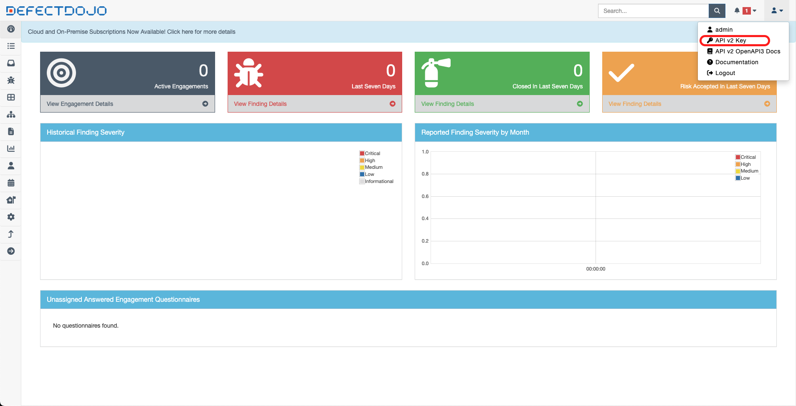
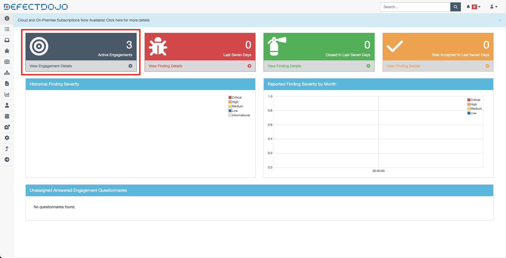

## VAmPI Analyzer

#### Objetivo
O projeto tem como objetivo realizar scanners SAST (Static application security testing) utilizando o [Bandit](https://bandit.readthedocs.io/en/latest/), SCA (Software Composition Analysis) com o [Trivy](https://trivy.dev/) e a busca de credênciais vazadas no histórico do git utilizando o [GitLeaks](https://gitleaks.io/). Ao final de cada scanner, os resultados serão enviados para o [DefectDojo](https://docs.defectdojo.com/).


#### Preparando o DefectDojo

 1. Executar os procedimentos para inicializar o DefectDojo.

    ```bash
    git clone --depth=1 https://github.com/DefectDojo/django-DefectDojo && \
    cd django-DefectDojo && \
    ./dc-build.sh && \
    ./dc-up-d.sh postgres-redis && \
    cd ..
    ```

2. Cerca de 3 a 5 minutos depois, executar o comando abaixo para capturar a senha do administrador do DefectDojo.
    ```bash
    docker compose -f django-DefectDojo/docker-compose.yml logs initializer | grep "Admin password:"
    ```
3. Com a senha do administrador em mãos, realizar o login na aplicação com o usuario *admin*, que será disponibilizada no endereço *http://seu-ip:8080/*.


4. Após o login da aplicação, copie o token gerado na seguiten tela:
    

5. Com o token em mãos, utilize-o para a excução dos scripts a seguir:
    ```bash
    export DEFECTDOJO_TOKEN='seu-token' && \
    bash defectdojo-shells/1-create-product.sh && \
    bash defectdojo-shells/2-create-sast-engagement.sh && \
    bash defectdojo-shells/3-create-sca-engagement.sh && \
    bash defectdojo-shells/4-create-secrets-engagement.sh
    ```
6. Verificar se os 3 engagements foram criados.


#### Preparando o Jenkins
1. Executar o docker compose do Jenkins.
    ```bash
    docker compose -f jenkins/docker-compose.yml up -d
    ```
2. Capturar a senha de administrador do Jenkins.
    ```bash
    docker exec jenkins_container cat /var/jenkins_home/secrets/initialAdminPassword
    ```
3. Acessar o endereço *http://seu-ip:8081/* e seguir as seguintes diretivas:
3.1. Inserir senha do administrador.

3.2. Instalar extensões sugeridas.

3.3. Ignorar criação do usuário. Após essa tela só basta avançar.


4. Acesse ***Gerenciar Jenkins > Console de script***. Cole e execute o script abaixo e verifique se na tela inicial do Jenkins se o job **vampi-analyzer** foi criado.
    ```groovy
    import jenkins.model.*
    import hudson.model.*
    import org.jenkinsci.plugins.workflow.job.WorkflowJob
    import org.jenkinsci.plugins.workflow.cps.CpsFlowDefinition

    def jenkins = Jenkins.instance

    def jobName = "vampi-analyzer"
    def job = jenkins.createProject(WorkflowJob, jobName)
    def pipelineScript = new File('/var/jenkins_home/vampi-analyzer.jenkinsfile').text
    job.definition = new CpsFlowDefinition(pipelineScript, true)
    job.save()
    ```
5. Ir nas configurações do job **vampi-analyzer** e adicionar o **IP** e **TOKEN** do DefectDojo. Em seguida, Salvar e executar o pipeline.

    

#### Verificação dos dados enviados no DefectDojo

Acessando o produto **vampi-analyzer** é possivel verificar os itens encontrados, esses itens sãoo os dados enviados do pipeline executado no Jenkins.


Além disso, é possivel classificá-las e marcar se a vulnerabilidade foi mitigada ou não. É possivel também a visualização das vulnerabilidades catalogadas por engagement.


